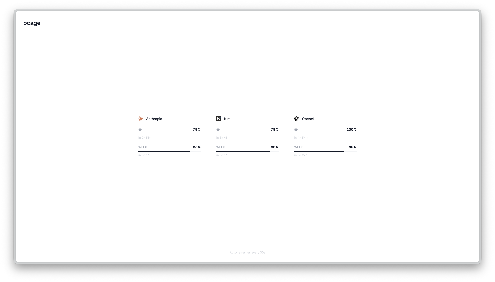

# ocage

A real-time dashboard for monitoring OpenCode usage limits across providers.

<p align="center">
  
</p>

## Install

```bash
curl -fsSL https://raw.githubusercontent.com/segersniels/ocage/master/install.sh | bash
```

<details>
<summary>Build from source</summary>

Requires [Bun](https://bun.sh).

```bash
git clone https://github.com/segersniels/ocage.git
cd ocage
bun install
make install
```
</details>

## License

MIT
